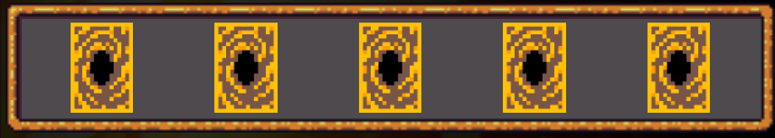
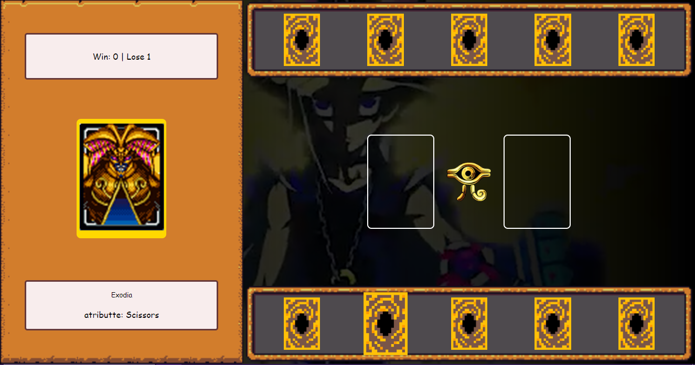
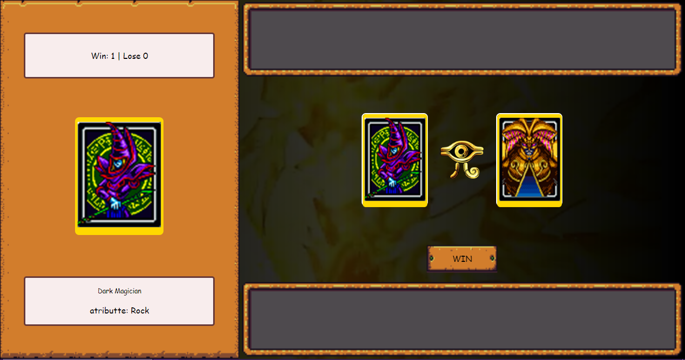

# Yu-Gi-Oh! Jokenpo Game

### Este é um simples jogo Yu-Gi-Oh! Jokenpo desenvolvido em HTML, CSS e JavaScript. No jogo, os jogadores escolhem cartas de Yu-Gi-Oh! e competem entre si em um formato semelhante ao "Pedra, Papel e Tesoura".

**Instruções do jogo**

O jogo possui duas áreas de cartas, uma para o jogador e outra para o computador.



- Passe o mouse nas cartas para selecionar a carta que deseja jogar.



**O computador também selecionará uma carta aleatória**.

- Ambas cartas serão reveladas, e o resultado do duelo será exibido.



### O placar será atualizado com o número de vitórias e derrotas do jogador e as cartas serão redistribuídas para um novo duelo.

**_Continue jogando para ver quantos duelos você pode vencer!_**

## Estrutura do Projeto

```
index.html: Contém a estrutura HTML da página do jogo.

src/styles/: Pasta que contém os arquivos CSS para estilizar o jogo.

src/assets/: Pasta para armazenar recursos como imagens e vídeos.

src/scripts/: Pasta que contém os arquivos JavaScript para a lógica do jogo.
```

## Como Personalizar o Jogo

- Adicionar Novas Cartas: Para adicionar novas cartas, edite o array cardData no arquivo engine.js com os detalhes da nova carta.

## Personalizar Estilos

- Edite os arquivos CSS na pasta styles/ para personalizar a aparência do jogo.

## Recursos Utilizados

- Yu-Gi-Oh! Cards: As imagens das cartas são recursos do jogo Yu-Gi-Oh!, e os direitos autorais pertencem aos seus respectivos proprietários.

- Vídeo de Fundo: Um vídeo de fundo é usado para dar um toque temático ao jogo.

**O jogo Yu-Gi-Oh! Jokenpo foi criado como um projeto de aprendizado e diversão. Aproveite jogando e sinta-se à vontade para personalizar e expandir o jogo conforme necessário!**

_Esse projeto foi reproduzido a partir do projeto desenvolvido pelo [Felipe Aguiar](https://github.com/felipeAguiarCode) para o BootCamp Potência Tech iFood - Desenvolvimento de Jogos na DIO_
